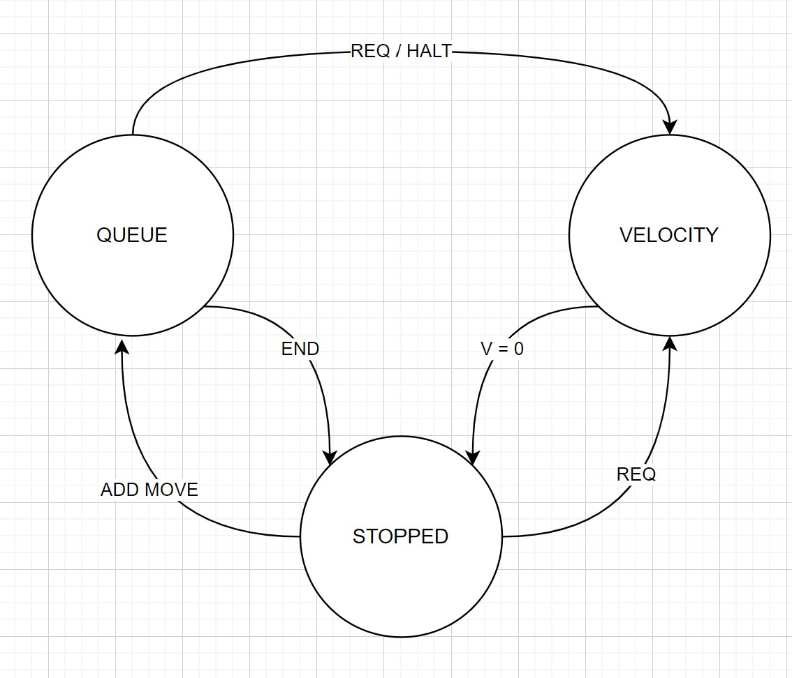

## 2023 02 02

Alright... time for this. First up is figuring what's the current situation... I'm going to dev on the older D21 boards, largely because I want to stay fab-friendly w/ the code (not exceeding time / space constraints) but also because I don't want to immediately launch into a new micro. Either way... 

OK,

- motors have get-new-segment endpoint, 
  - for now it's acked, we do windows au-manuel 
- and on-segment-complete endpoint,
- synchronizer pipes itself to new-segments, does promise.all() to ship each 
- awaits on-complete from each for windows, 

This will mean that setup happens whenever we call `createSynchronizer()` so I figure that should be a ~ promise, and we guard against calls pre-setup? 

I'd like to get the other codes out to check how they run. 

Yar OK I think I'm oriented-ish... this would for sure start in the motor... trajectories are going to have 7 DOF baked in, then actuators will just select. I think since i.e. seg-complete-acks are going to pipe back up, each actuator will have an ID (that's its indice in that 7DOF object) which will let us differentiate messages. Segments will each have a uint32_t segnumber. 

There's ~ some complications, ish: we have lower level codes using *steps* as an underlying unit, then we do conversions in the synchronizer / motor. I think that... makes sense w/r/t the fixed point maths in particular, since we have positions in 64-bit wide and velocities, etc in 32-bit wide, then we wrap position only the once. 

### Queue State vs. Per-Actuator State

This is ~ the returnal question w/ this project. We have the motor's own local state, and then the trajectory (segment) state. Operating them independently seems wild, so I'm going to return here to a world where the only state is the group state, actuators know which of the seven they are (and can addnl'y do some transforms if they'd like, in the future), and so do supervisory codes. We can wrap 7DOF kit up into 1DOF function calls whenever we'd like, but not visa-versa, etc. 

OK, programming tasks are simple enough then... 

- refactor state as pos[7], vect[7], vel, accel, that's underlying actuator-truth, and it's fixed point internal but floating interfaces
- operate modally for these, have local axisPick value... 
- setup to integrate thru a queue

I think also... since the position-integration kit is tricky, we can also do "position" targets via queue management... and then we can keep a velocity mode.

OK, it's like this;

We can go from stopped into either operating state, by adding moves or issuing velocity-target requests. A "position mode" request is demoted to adding a move to the queue, or is sort of hidden.

From either we can exit to "stopped" - by finishing our queue or by arriving at v=0. We can additionally bump from QUEUE to VEL mode, which is likely to be common-ish when we i.e. want to halt mid-queue. I *think* this might be possible when directions change, but am not sure, and will find out later on... since we will wind up in that case with a 7-wide vector of velocities, each of which might have its own acceleration... reconciling which is a task for later. 

### Timelessness

I had a walk out to grab lunch and was thinking again about what Laurens showed us the other day... well, was thinking about how to make MAXL "abstract" across hardware, where we *don't have a guarantee that we are running in a fixed interval* - which would anyways be a nice thing to do without: in case we have mixed micros with mixed interrupt codes, mixed rates, etc. 

So, pre-computing trajectories, and then evaluating them on a clock allows us to setup a loop that is free running and in most cases will be faster than the interrupt we set... then we just guard it out when we get or switch between queue moves, express everything in trajectories (but can still do i.e. velocity and motion modes, nicely), and... bammo. Makes a tonne of sense, actually. 

But is also more substantially different than this re-write was going to be, so we're into some heftier code lifting. 

- if more than one step in integration, trouble, *but* h-bridge steppers can macro-step dynamically 
- trajectory function-call also lets us call into the future... for lookahead algos 

Yar, this is a big ol' swap, but if I can get the representations and calculations correct I'm in good business, let's see. 

I should do:

- a trajectory encoding, in 7dof, in time ? 
- find Laurens' docs, 
- do maxl_eval(time), 
- how to in-out from system ? 

---

## End of Cycle Tasks

- velocity mode, 
- position mode is ~ the operation of one-segment queues, 
  - to do i.e. live machining, query positions and update velocity targets 
- ... nice sequential motion, lol, 
- some of stepper firmware -> RPC based ?
- maxl as a library (?) or at least renamed 
- decouple hardware:maxl codes 
  - and i.e. the multiple-stepper versions... how to deal ? 
- some systems diagrams, gd 
- how well can we stop in-queue ? 
- the modular-things repo could use some docdoc
  - and rm the videos, host 'em elsewhere 